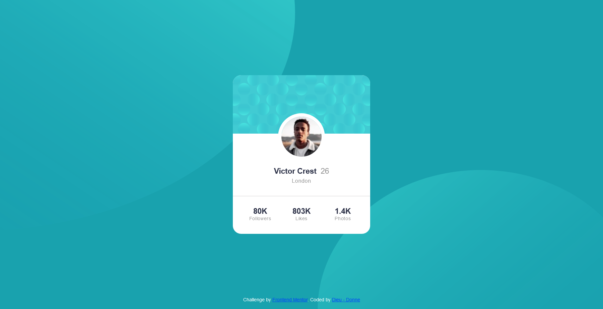

# Frontend Mentor - Profile card component solution

This is a solution to the [Profile card component challenge on Frontend Mentor](https://www.frontendmentor.io/challenges/profile-card-component-cfArpWshJ). Frontend Mentor challenges help you improve your coding skills by building realistic projects. 

## Table of contents

- [Overview](#overview)
  - [The challenge](#the-challenge)
  - [Screenshot](#screenshot)
  - [Links](#links)
  - [Built with](#built-with)
  - [What I learned](#what-i-learned)
  - [Useful resources](#useful-resources)
- [Author](#author)

## Overview

### The challenge

- Build out the project to the designs provided

### Screenshot

### Links

- Solution URL: https://github.com/d-donne/profile-card-component
- Live Site URL: [Pofile Card Component](https://d-donne.github.io/profile-card-component/)

### Built with

- Semantic HTML5 markup
- CSS custom properties
- Flexbox
- CSS Grid

### What I learned

How to use multiple images along side a background image and correctly adjust their positioning

### Useful resources

- [Controlling background-images (Kevin Powell)](https://www.youtube.com/watch?v=3T_Jy1CqH9k)

## Author

- Frontend Mentor - [Dieu - Donne](https://www.frontendmentor.io/profile/d-donne)

- Twitter - [@d_donne7](https://www.twitter.com/d_donne7)